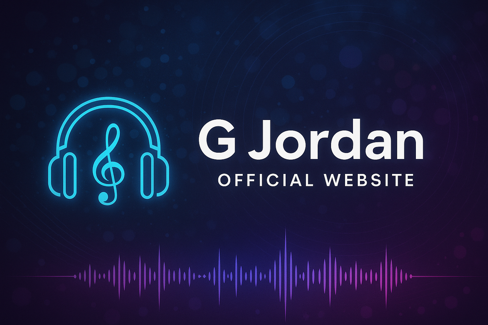

# 🎶 G-Jordan Official Website ([gjordan.music](https://gjordan.music))

<p align="center">
  
</p>

<p align="center">
  <a href="https://gjordan.music"></a>
  <a href="https://firebase.google.com/"></a>
  <a href="https://acode.app/"></a>
  <a href="https://termux.dev/"></a>
  <a href="https://developer.android.com/"></a>
  <a href="https://git-scm.com/"></a>
  <a href="https://javascript.com/"></a>
  <a href="https://html.spec.whatwg.org/"></a>
  <a href="https://www.w3.org/Style/CSS/Overview.en.html"></a>
  <a href="https://github.com/"></a>
  <a href="#-license--attribution"></a>
</p>

---

> **gjordan.music** is the official music & creative site of **G Jordan** — developed, coded, and deployed entirely on an Android phone!  
> Mobile-first, cloud-powered, and built for music fans and creators.

---

## ✨ Overview

The **G Jordan Official Website** is a vibrant, media-driven platform for streaming music, exploring visuals, and connecting with the artist’s story.  
The site was **fully built on Android**, leveraging mobile coding tools, cloud databases, and static hosting for a futuristic, creator-owned workflow.

---

## 🚀 Table of Contents

- [Features](#-features)
- [Tech Stack](#-tech-stack)
- [Project Structure](#-project-structure)
- [Getting Started](#-getting-started)
- [More About the Project](#-more-about-the-project)
- [License & Attribution](#-license--attribution)
- [Connect](#-connect)

---

## 🌟 Features

| Feature                   | Description                                                                                  |
|---------------------------|----------------------------------------------------------------------------------------------|
| 🎵 **Custom Music Player**| Stylish, responsive player with playlist support, glowing UI, and theming.                   |
| 📊 **Live Analytics**     | Real-time tracking of plays, likes/dislikes, downloads via Firebase Firestore.               |
| 🔑 **User Accounts**      | Firebase Auth for sign-up/sign-in, creating a personal fan experience.                       |
| 📨 **Contact & About**    | Pages for direct fan outreach and the G Jordan story.                                        |
| 🎨 **Glassmorphism Design**| Responsive, animated UI: gradients, glass blur, glowing borders, and night/day modes.        |
| 🚀 **Fast Static Hosting**| GitHub Pages for blazing-fast load times, custom domain, and zero server costs.              |
| 📱 **Fully Mobile Dev**   | Code, commit, and deploy from Android using Acode IDE and Termux Linux shell.                |
| 🔗 **Direct Streaming**   | Stream music from anywhere, on any device, no app required.                                  |
| 🛡️ **Copyright**         | Custom license and visible credit policy to protect unique design and brand.                  |

---

## 🛠️ Tech Stack

| Area             | Technology/Tool         | Badge                                                                                   |
|------------------|------------------------|-----------------------------------------------------------------------------------------|
| **Frontend**     | HTML5, CSS3, JavaScript|    |
| **Backend**      | Firebase (Firestore, Auth, Hosting) |     |
| **Editor**       | Acode IDE (Android)    |   |
| **Dev Shell**    | Termux (Linux)         |                |
| **Version Control**| Git, GitHub          |   |
| **Deployment**   | GitHub Pages           |  |
| **Platform**     | Android Phone          |  |

---

## 📂 Project Structure

```text
.
├── images/           # Banners, logos, artwork
├── js/               # JavaScript (music player, analytics, UI)
├── css/              # Theming, glassmorphism, responsive styles
├── music/            # Audio files
├── about.html        # About page
├── contact.html      # Contact page
├── index.html        # Main site
├── CNAME             # Custom domain config
├── README.md         # This file!
└── ...
```

---

## 🚧 Getting Started

Want to explore, remix, or contribute?  
**You don’t need a PC — you can build right from your phone!**

1. **Clone the Repository**
   ```sh
   git clone https://github.com/G-Jordan/gjordan.git
   cd gjordan
   ```
2. **Open in [Acode IDE](https://acode.app/) (Android) or your favorite editor**
3. **Preview Locally**
   - Serve with [Acode’s live server](https://acode.app/) or run a local server in Termux:
     ```sh
     termux-open index.html
     # or use python -m http.server
     ```
4. **Deploy**
   - Push commits to `main` or `master` to update [yourDomain.music](https://gjordan.music) instantly via GitHub Pages.

---

## 💡 More About the Project

- **Mobile-First Mindset:**  
  Every line of code was written, tested, and deployed via an Android device — proving you can build professional, creative projects on-the-go!

- **Modern Visuals & Branding:**  
  The site uses glassmorphism, custom gradients, and glowing effects for a truly modern, music-inspired look.

- **Fan-Centric Experience:**  
  Listen, like, download, or reach out directly — all powered by real-time Firebase services.

- **Cloud Powered, Open Source:**  
  Source code is public for learning and remixing — but please respect the license!

---

## 🔒 License & Attribution

> **Copyright © G73**
>
> All layouts, designs, code, and branding are the intellectual property of G Jordan / G73.
>
> **If you fork, remix, or reuse this project, you _must_ provide visible credit to G Jordan / G73 in both your code and site footer.**

---

## 📬 Connect

- 🌐 **Website:** [https://gjordan.music](https://gjordan.music)
- 📧 **Contact:** See [contact.html](contact.html)
- 🎧 **Listen:** *(Add Spotify, YouTube, SoundCloud, or Bandcamp links here!)*
- 🐦 **Social:** *(Add your Twitter/X, Instagram, or other socials!)*

---

<p align="center">
  
</p>
```
